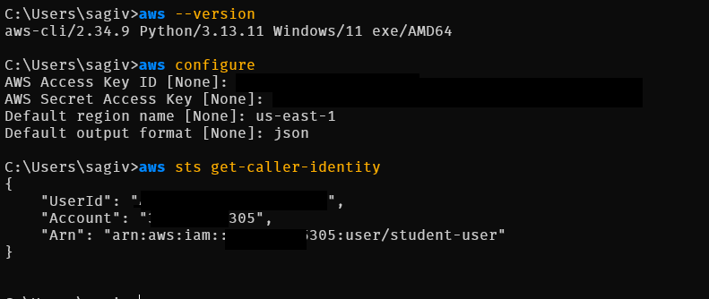
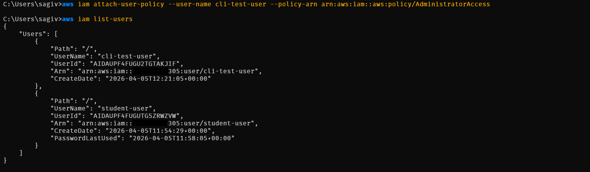
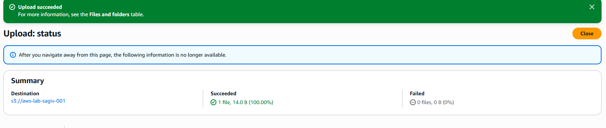
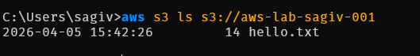
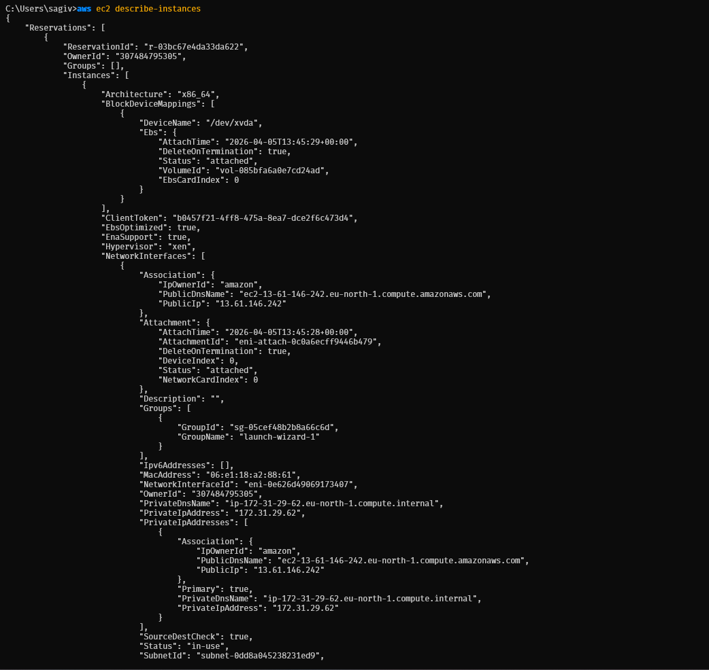
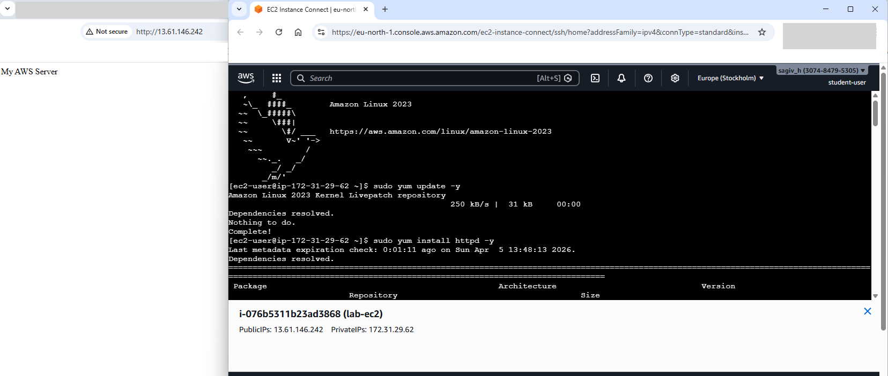
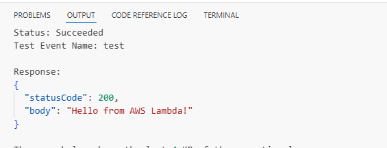
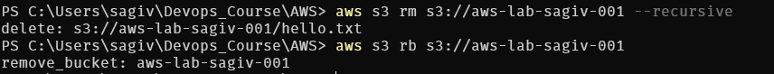
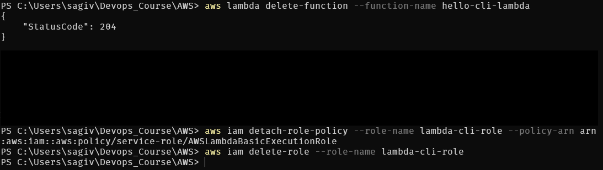

  

# AWS Free Tier Hands-On Lab

## Project Summary

This repository documents a hands-on AWS lab completed using both the AWS Management Console and AWS CLI. The project focused on practicing core cloud services within AWS Free Tier boundaries, including identity and access management, object storage, compute, networking, serverless functions, logging, and cleanup.

The documentation below is based only on the actions that were actually completed and evidenced during the lab.

---

## Lab Objectives

The main goals of this lab were to:

- configure and verify a working AWS environment
- practice using IAM users instead of relying on the root account
- upload and validate files in Amazon S3
- launch and access an EC2 instance
- inspect VPC resources and default networking
- create and test AWS Lambda functions
- work with CloudWatch log groups and log streams
- perform cleanup steps to avoid unnecessary charges

---

## AWS Services Used

- **AWS IAM**
- **Amazon S3**
- **Amazon EC2**
- **Amazon VPC**
- **AWS Lambda**
- **Amazon CloudWatch**
- **AWS CLI**

---

## Prerequisites

Before starting this lab, the following were required:

- An AWS account
- AWS CLI installed locally
- Basic terminal / command-line familiarity
- Access to the AWS Management Console
- An SSH key pair for EC2 access
- Basic understanding of AWS regions and Free Tier usage

---

## Hands-On Walkthrough

# 1. Account Setup

## Goal

Prepare the local environment and verify that AWS CLI access works correctly.

## What was done

The documented work begins from an already accessible AWS account. AWS CLI v2 was installed and configured locally, and the active identity was verified successfully.

The CLI session resolved to an IAM user named `student-user`, confirming that the lab was performed from a non-root working identity.

## Relevant CLI Commands

    aws --version
    aws configure
    aws sts get-caller-identity

## Result

The local AWS environment was ready for both console-based and CLI-based operations.

*AWS CLI was configured successfully and the active IAM identity was verified.*

---

# 2. IAM

## Goal

Work with IAM identities and validate user management operations through the AWS CLI.

## What was done

An IAM user named `student-user` was used for the lab session. In addition, a CLI-managed test user named `cli-test-user` was visible in the account and had administrative permissions attached for lab execution.

The IAM user list confirmed that the relevant users were created and available.

## Relevant CLI Commands

    aws iam create-user --user-name cli-test-user
    aws iam attach-user-policy --user-name cli-test-user --policy-arn arn:aws:iam::aws:policy/AdministratorAccess
    aws iam list-users

## Result

IAM access worked correctly, and user-level operations through the AWS CLI were completed successfully.

*The CLI test user was visible in IAM and user management commands completed successfully.*

---

# 3. S3

## Goal

Upload a file to Amazon S3 and verify its presence through the CLI.

## What was done

An S3 bucket named `aws-lab-sagiv-001` was used during the lab. A file named `hello.txt` was uploaded successfully through the AWS Console, and the object was then verified through the CLI by listing the bucket contents.

The original lab also included an optional public access step, but that action is not documented in the available evidence and is therefore not claimed here.

## Relevant CLI Commands

    aws s3 ls s3://aws-lab-sagiv-001

## Result

The uploaded file was successfully stored in S3 and confirmed through the AWS CLI.

*The file `hello.txt` was uploaded successfully to the S3 bucket.*

*The AWS CLI confirmed that `hello.txt` exists in the bucket.*

---

# 4. EC2

## Goal

Launch an EC2 instance, access it remotely, and validate a simple web server setup.

## What was done

An EC2 instance named `lab-ec2` was launched successfully from the console and shown in a running state. The instance details were then inspected through the CLI.

Remote access was established using SSH and Instance Connect. During the session, a web server was installed and configured to serve a simple page returning the message `My AWS Server`.

The result was validated both from the terminal and from a browser.

## Relevant CLI Commands

    aws ec2 describe-instances
    ssh -i "<path-to-key>.pem" ec2-user@<public-ip>
    sudo yum update -y
    sudo yum install httpd -y
    cat /var/www/html/index.html

## Result

The lab successfully demonstrated EC2 instance deployment, remote access, and a basic hosted web page.

*The EC2 instance `lab-ec2` was launched successfully and entered the running state.*

*The instance metadata was retrieved successfully using `aws ec2 describe-instances`.*

*SSH access to the EC2 instance was established successfully and the web content was verified on the server.*

*The instance was reachable, the web server was installed, and the browser displayed `My AWS Server`.*

---

# 5. VPC

## Goal

Inspect the networking environment used by the lab resources.

## What was done

The default VPC was reviewed in both the AWS Console and the AWS CLI. The documented evidence shows the VPC details and associated subnets.

The original lab instructions also mentioned optionally creating a custom VPC and subnet, but no evidence for that optional step appears in the current screenshot set.

## Relevant CLI Commands

    aws ec2 describe-vpcs

## Result

The default VPC and its network resources were identified and inspected successfully.

*The default VPC was reviewed in both the AWS Console and the AWS CLI.*

---

# 6. Lambda

## Goal

Create and test AWS Lambda functions using both the AWS Console and the AWS CLI.

## What was done

A console-based Lambda function named `Test` was configured with Python 3.11 and tested successfully. The function returned the expected message: `Hello from AWS Lambda!`

A CLI-based Lambda workflow was also completed. This included:

- creating a role named `lambda-cli-role`
- retrieving the role ARN
- creating a function named `hello-cli-lambda`
- invoking the function successfully
- verifying the returned output in a local file

## Relevant CLI Commands

    aws iam create-role --role-name lambda-cli-role --assume-role-policy-document file://trust-policy.json
    aws iam get-role --role-name lambda-cli-role --query "Role.Arn" --output text
    aws lambda create-function --function-name hello-cli-lambda --runtime python3.11 --role <role-arn> --handler lambda_function.lambda_handler --zip-file fileb://function.zip
    aws lambda invoke --function-name hello-cli-lambda output.txt
    type output.txt

## Result

Both the console-based and CLI-based Lambda workflows were completed successfully and produced the expected output.

*The console-based Lambda function was configured using Python 3.11.*

*The Lambda function test completed successfully and returned the expected response.*

*The execution role for the CLI-based Lambda function was created successfully.*

*The CLI Lambda function was created and invoked successfully, and the output file returned the expected body.*

---

# 7. CloudWatch

## Goal

Create logging resources and validate log ingestion and retrieval.

## What was done

A CloudWatch log group named `lab-log-group` was created in the console with a retention period of 3 days. A log stream named `lab-stream` was then created successfully.

The AWS CLI was used to push a custom log event and retrieve it afterward. In addition, the CloudWatch console showed Lambda-generated log groups that were automatically created during Lambda testing and invocation.

## Relevant CLI Commands

    aws logs create-log-group --log-group-name lab-log-group
    aws logs create-log-stream --log-group-name lab-log-group --log-stream-name lab-stream
    aws logs put-log-events --log-group-name lab-log-group --log-stream-name lab-stream --log-events timestamp=<timestamp>,message="Hello CloudWatch CLI"
    aws logs get-log-events --log-group-name lab-log-group --log-stream-name lab-stream

## Result

CloudWatch logging worked successfully for both manual log events and automatically generated Lambda logs.

*The custom log group `lab-log-group` was configured in the console.*

*The log stream `lab-stream` was created successfully.*

*The CLI successfully pushed and retrieved the message `Hello CloudWatch CLI`.*

*CloudWatch displayed both the custom log group and Lambda-generated log groups.*

---

# 8. Cleanup / Cost Avoidance

## Goal

Remove lab resources to reduce the chance of ongoing charges.

## What was done

Cleanup actions were documented for S3, Lambda, IAM-related Lambda role cleanup, and EC2 lifecycle control.

The S3 bucket contents were removed and the bucket itself was deleted. The CLI-created Lambda function was deleted, and related Lambda role and policy cleanup steps were shown. The EC2 instance was also stopped and later terminated.

The original lab cleanup section also mentioned optional VPC and IAM user cleanup. Those specific steps are not fully evidenced in the provided screenshots, so they are not overstated here.

## Relevant CLI Commands

    aws s3 rm s3://aws-lab-sagiv-001 --recursive
    aws s3 rb s3://aws-lab-sagiv-001

    aws lambda delete-function --function-name hello-cli-lambda
    aws iam detach-role-policy --role-name lambda-cli-role --policy-arn arn:aws:iam::aws:policy/service-role/AWSLambdaBasicExecutionRole
    aws iam delete-role --role-name lambda-cli-role

    aws ec2 stop-instances --instance-ids <instance-id>
    aws ec2 terminate-instances --instance-ids <instance-id>

## Result

The main billable lab resources were cleaned up successfully.

*The S3 object and bucket were removed as part of the cleanup process.*

*The CLI-created Lambda function and related role cleanup steps were completed.*

*The EC2 instance was stopped to prevent unnecessary runtime charges.*

*The EC2 instance was later terminated as part of final cleanup.*

---

## Cost Safety / Cleanup Notes

Working inside AWS Free Tier still requires careful cleanup and cost awareness. During this lab, the main protection steps were:

- stopping and terminating the EC2 instance after use
- removing uploaded S3 content and deleting the bucket
- deleting the CLI-created Lambda function
- cleaning up the Lambda execution role
- avoiding unnecessary long-running services

This is especially important because some AWS resources may continue to generate charges if they remain active after testing.

---

## Key Takeaways / What I Learned

This lab provided practical experience with several core AWS workflows:

- how to use AWS CLI alongside the AWS Console
- why IAM users are preferred for day-to-day work
- how to verify object storage actions in Amazon S3
- how to launch, inspect, and access an EC2 instance
- how default VPC resources support basic deployments
- how Lambda functions can be created and tested from both console and CLI
- how CloudWatch logs can be created, viewed, and used for operational visibility
- why cleanup is an essential part of responsible cloud usage

---

## Notes

- This README reflects only the steps that were actually documented during execution.
- Optional lab items were only included when evidence was available.
- Some cleanup actions referenced in the original task were only partially documented, so they are described conservatively.
- The project was completed as a beginner-level cloud practice lab with a DevOps-oriented workflow.

---

## Conclusion

This AWS Free Tier hands-on lab provided a solid introduction to working with foundational AWS services using both graphical and command-line interfaces. It combined practical infrastructure work with basic operational discipline, including verification, testing, logging, and cleanup.

For a beginner cloud project, this lab served as a useful end-to-end exercise in provisioning, validating, and safely removing AWS resources.